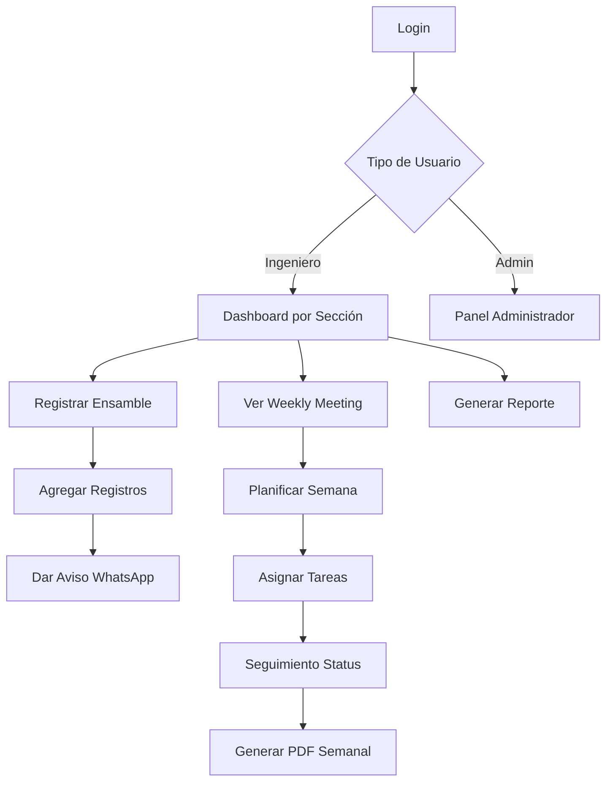

# 🏭 Topre Engineer Control

Sistema integral de control y seguimiento de ensambles para ingenieros de manufactura. Desarrollado con React + Vite + Firebase.


---

## 📋 Tabla de Contenidos

- [Descripción General](#-descripción-general)
- [Características Principales](#-características-principales)
- [Arquitectura del Sistema](#-arquitectura-del-sistema)
- [Módulos del Sistema](#-módulos-del-sistema)
  - [Weekly Meetings (Reuniones Semanales)](#-weekly-meetings---reuniones-semanales)
  - [Dashboards por Sección](#-dashboards-por-sección)
  - [Sistema de Notificaciones WhatsApp](#-sistema-de-notificaciones-whatsapp)
  - [Generación de Reportes PDF](#-generación-de-reportes-pdf)
- [Estructura del Proyecto](#-estructura-del-proyecto)
- [Tecnologías Utilizadas](#-tecnologías-utilizadas)
- [Instalación y Configuración](#-instalación-y-configuración)
- [Uso del Sistema](#-uso-del-sistema)

---

## 🎯 Descripción General

**Topre Engineer Control** es una aplicación web diseñada para gestionar y monitorear el proceso de ensambles en una planta de manufactura. El sistema permite:

- Registrar y dar seguimiento a ajustes en troqueles y ensambles
- Planificar actividades semanales mediante reuniones colaborativas
- Notificar en tiempo real a supervisores vía WhatsApp
- Generar reportes PDF profesionales para presentaciones
- Gestionar ingenieros por secciones (ASSY, PRESS, HOT-PRESS)

---

## ⭐ Características Principales

| Característica                 | Descripción                                                   |
| ------------------------------ | ------------------------------------------------------------- |
| 🔐 **Autenticación**           | Sistema de login con roles (Admin/Ingeniero) y secciones      |
| 📊 **Dashboards**              | Paneles personalizados por área (ASSY, PRESS, HOT-PRESS)      |
| 📅 **Weekly Meetings**         | Planificación semanal colaborativa con edición en tiempo real |
| 📱 **Notificaciones WhatsApp** | Avisos instantáneos a supervisores mediante Evolution API     |
| 📄 **Reportes PDF**            | Generación automática de reportes profesionales               |
| 🔄 **Tiempo Real**             | Sincronización instantánea con Firebase Firestore             |
| 📲 **Responsive**              | Diseño adaptable a móviles, tablets y desktop                 |

---

## 🏗️ Arquitectura del Sistema

```
┌─────────────────────────────────────────────────────────────┐
│                      FRONTEND (React + Vite)                │
├─────────────────────────────────────────────────────────────┤
│  ┌─────────────┐  ┌─────────────┐  ┌─────────────────────┐  │
│  │   Login     │  │  Dashboards │  │  Weekly Meetings    │  │
│  │   Page      │  │  (3 áreas)  │  │  (Planificación)    │  │
│  └─────────────┘  └─────────────┘  └─────────────────────┘  │
├─────────────────────────────────────────────────────────────┤
│                    SERVICIOS EXTERNOS                        │
│  ┌──────────────────┐  ┌────────────────────────────────┐   │
│  │ Firebase         │  │ Evolution API (WhatsApp)       │   │
│  │ - Auth           │  │ - Envío de mensajes            │   │
│  │ - Firestore      │  │ - Notificaciones automáticas   │   │
│  └──────────────────┘  └────────────────────────────────┘   │
└─────────────────────────────────────────────────────────────┘
```

---

## 📦 Módulos del Sistema

### 📅 Weekly Meetings - Reuniones Semanales

> **Esta es una de las funcionalidades más potentes del sistema**, diseñada para planificar y presupuestar el trabajo semanal de ingeniería.

#### ¿Qué es?

El módulo de **Weekly Meetings** permite planificar las actividades de la semana, asignar responsables y dar seguimiento al progreso de cada tarea. Es ideal para:

- **Generar presupuestos semanales**: Planificar cuántos ensambles se trabajarán
- **Asignar responsables**: Cada tarea se asigna a un ingeniero específico
- **Seguimiento de status**: Pendiente → En Proceso → Terminado
- **Reportes para presentaciones**: Generar PDFs profesionales para reuniones

#### Estructura de Datos

```
📁 weeklyMeetings (Colección)
│
├── 📄 2026-W02 (Documento: Año-Semana)
│   ├── weekNumber: 2
│   ├── year: 2026
│   ├── startDate: "2026-01-05"
│   ├── endDate: "2026-01-11"
│   │
│   └── 📁 days (Subcolección)
│       ├── 📄 lunes
│       │   └── 📁 rows
│       │       ├── lunes-assy-row-0
│       │       ├── lunes-assy-row-1
│       │       ├── lunes-press-row-0
│       │       └── ...
│       ├── 📄 martes
│       ├── 📄 miercoles
│       ├── 📄 jueves
│       ├── 📄 viernes
│       └── 📄 sabado
```

#### Campos por Registro

| Campo         | Tipo   | Descripción                                  |
| ------------- | ------ | -------------------------------------------- |
| `id`          | string | Identificador único (ej: `lunes-assy-row-0`) |
| `tipo`        | select | QC, TEACH (ASSY) / QC, LASER (PRESS)         |
| `maquina`     | string | Nombre de la máquina                         |
| `modelo`      | string | Modelo del producto                          |
| `numero`      | string | Número de parte                              |
| `status`      | select | pendiente, en_proceso, terminado, cancelado  |
| `responsable` | string | Ingeniero asignado                           |
| `comentarios` | string | Notas adicionales                            |
| `locks`       | object | Sistema de bloqueo para edición concurrente  |

#### Funcionalidades Clave

1. **Edición Colaborativa en Tiempo Real**

   - Múltiples usuarios pueden editar simultáneamente
   - Sistema de bloqueo de celdas para evitar conflictos
   - Indicador visual cuando alguien está editando

2. **Navegación por Días**

   - Tabs para cada día de la semana (Lunes - Sábado)
   - Vista independiente por día
   - Contador de registros por día

3. **Generación de PDF Semanal**

   - Reporte profesional con todos los días
   - Resumen estadístico (totales, terminados, pendientes)
   - Diseño optimizado para impresión

4. **Cálculo ISO 8601 de Semanas**
   - Identificación correcta de semanas según estándar internacional
   - Manejo de semanas de transición entre años

```javascript
// Ejemplo de ID de semana: "2026-W02"
const getCurrentWeekId = () => {
  // Calcula usando el método del jueves (ISO 8601)
  // Retorna formato: YYYY-WXX
};
```

---

### 📊 Dashboards por Sección

El sistema cuenta con **3 dashboards especializados**:

#### 1. EngineerDashboard (ASSY - Ensambles)

- **Ruta**: `/engineer/assy`
- **Tipos de trabajo**: QC Level Up, TEACH
- **Campos específicos**: Mikomi, Atari, Ajustes Extras

#### 2. PressDashboard (Prensas)

- **Ruta**: `/engineer/press`
- **Tipos de trabajo**: QC, TEACH
- **Campos específicos**: Trayectoria puntas, Soldadura, Liberación JIG

#### 3. HotPressDashboard (Prensas en Caliente)

- **Ruta**: `/engineer/hot-press`
- **Tipos de trabajo**: QC, LASER
- **Campos específicos**: Similar a PRESS

#### Características Comunes

- **Vista de tabla** con filtrado por tipo (QC/TEACH)
- **Barra de progreso** visual del porcentaje alcanzado
- **Indicadores de estado** (OK/NG/Pendiente)
- **Fechas de inicio y deadline**
- **Acceso rápido a detalle** de cada ensamble

---

### 📱 Sistema de Notificaciones WhatsApp

> **Funcionalidad crítica** para alertar a supervisores sobre el progreso de ensambles.

#### ¿Cómo funciona?

1. El ingeniero hace clic en el botón **"Dar Aviso"** en cualquier ensamble
2. Se construye un mensaje estructurado con los datos del ensamble
3. Se envía vía **Evolution API** a los números configurados
4. Los supervisores reciben el mensaje instantáneamente en WhatsApp

#### Configuración

```javascript
// Lista de números de WhatsApp para notificaciones
const whatsappNumbers = [
  "5214271635691@s.whatsapp.net",
  "5215660548768@s.whatsapp.net",
];
```

#### Estructura del Mensaje

```
🔔 *AVISO DE ENSAMBLE - PRESS*

👷 *Enviado por:* Juan Pérez
📋 *Tipo:* QC
🔧 *Máquina:* LINEA-01
📦 *Modelo:* ABC-123
🔢 *Número:* #45678

📊 *Porcentaje alcanzado:* 97%

⚠️ *Favor de acercarse a revisar el ensamble final.*
```

#### Implementación Técnica

```javascript
const handleSendNotification = async (assembly) => {
  // Construir mensaje con datos del ensamble
  const mensaje = `🔔 *AVISO DE ENSAMBLE - PRESS*\n\n...`;

  // Enviar a cada número configurado
  for (const number of whatsappNumbers) {
    await fetch("https://evolution-api-url/message/sendText/Instance", {
      method: "POST",
      headers: {
        "Content-Type": "application/json",
        apikey: "YOUR_API_KEY",
      },
      body: JSON.stringify({
        number: number,
        text: mensaje,
        delay: 1200,
      }),
    });
  }
};
```

#### Estados del Botón

| Estado     | Visual            | Descripción          |
| ---------- | ----------------- | -------------------- |
| Normal     | 🟠 Amarillo       | Listo para enviar    |
| Enviando   | ⚪ Gris + Spinner | Procesando envío     |
| Completado | ✅ Alert          | Notificación exitosa |

---

### 📄 Generación de Reportes PDF

El sistema genera reportes profesionales en PDF usando **jsPDF** y **html2canvas**.

#### Tipos de Reportes

1. **Reporte Individual de Ingeniero**

   - Selección de ensambles específicos
   - Separación por tipo (QC/TEACH)
   - Opción de envío por email

2. **Reporte Semanal (Weekly Meeting)**
   - Datos de toda la semana
   - Separación por días
   - Resumen estadístico

#### Estructura del PDF

```
┌────────────────────────────────────────┐
│        HEADER con Gradiente            │
│   📊 Reporte de Ensambles              │
│   Semana 02 • 2026                     │
│   05 enero - 11 enero                  │
├────────────────────────────────────────┤
│   📅 LUNES                             │
│   ┌────────────────────────────────┐   │
│   │ 📦 Ensambles (ASSY) - 5 reg.   │   │
│   │ Tabla con datos...             │   │
│   └────────────────────────────────┘   │
│   ┌────────────────────────────────┐   │
│   │ ⚙️ Prensas (PRESS) - 3 reg.    │   │
│   │ Tabla con datos...             │   │
│   └────────────────────────────────┘   │
├────────────────────────────────────────┤
│   📊 RESUMEN DE LA SEMANA              │
│   [8] Ensambles [3] Prensas            │
│   [7] Terminados [2] En Proceso        │
├────────────────────────────────────────┤
│        FOOTER con créditos             │
└────────────────────────────────────────┘
```

---

## 📁 Estructura del Proyecto

```
topre-engineer-control/
├── 📁 src/
│   ├── 📁 components/          # Componentes reutilizables
│   │   ├── AssemblyModal.jsx   # Modal para crear ensambles
│   │   ├── Calendar.jsx        # Calendario visual
│   │   ├── HotPressModal.jsx   # Modal específico Hot Press
│   │   ├── Navbar.jsx          # Barra de navegación
│   │   ├── PhotoUploader.jsx   # Carga de fotos
│   │   ├── ProtectedRoute.jsx  # Rutas protegidas
│   │   └── ReportModal.jsx     # Modal de reportes PDF
│   │
│   ├── 📁 pages/               # Páginas principales
│   │   ├── AdminDashboard.jsx  # Panel de administrador
│   │   ├── Login.jsx           # Página de inicio de sesión
│   │   │
│   │   ├── # ASSY (Ensambles)
│   │   ├── EngineerDashboard.jsx
│   │   ├── AssemblyDetail.jsx
│   │   ├── AssemblyView.jsx
│   │   │
│   │   ├── # PRESS (Prensas)
│   │   ├── PressDashboard.jsx
│   │   ├── PressDetail.jsx
│   │   ├── PressView.jsx
│   │   │
│   │   ├── # HOT-PRESS
│   │   ├── HotPressDashboard.jsx
│   │   ├── HotPressDetail.jsx
│   │   ├── HotPressView.jsx
│   │   │
│   │   └── # WEEKLY MEETINGS
│   │   ├── WeeklyMeetings.jsx      # Lista de semanas
│   │   └── WeeklyMeetingDetail.jsx # Detalle de semana
│   │
│   ├── 📁 contexts/            # Contextos de React
│   │   └── AuthContext.jsx     # Autenticación global
│   │
│   ├── 📁 config/              # Configuraciones
│   │   └── firebase.js         # Configuración Firebase
│   │
│   ├── App.jsx                 # Rutas principales
│   ├── main.jsx                # Entry point
│   └── index.css               # Estilos globales
│
├── 📄 package.json
├── 📄 vite.config.js
├── 📄 tailwind.config.js
└── 📄 README.md
```

---

## 🛠️ Tecnologías Utilizadas

### Frontend

| Tecnología   | Versión | Uso          |
| ------------ | ------- | ------------ |
| React        | 19.1    | Framework UI |
| Vite         | 7.1     | Build tool   |
| TailwindCSS  | 4.1     | Estilos      |
| React Router | 7.9     | Navegación   |

### Backend/Servicios

| Servicio           | Uso                          |
| ------------------ | ---------------------------- |
| Firebase Auth      | Autenticación de usuarios    |
| Firebase Firestore | Base de datos en tiempo real |
| Evolution API      | Envío de mensajes WhatsApp   |

### Librerías Adicionales

| Librería          | Uso                       |
| ----------------- | ------------------------- |
| jsPDF             | Generación de PDFs        |
| html2canvas       | Captura de HTML para PDF  |
| @headlessui/react | Componentes UI accesibles |

---

## 🚀 Instalación y Configuración

### Requisitos Previos

- Node.js 18+
- npm o yarn
- Cuenta de Firebase
- (Opcional) Evolution API para WhatsApp

### Pasos de Instalación

```bash
# 1. Clonar el repositorio
git clone https://github.com/tu-usuario/topre-engineer-control.git

# 2. Navegar al directorio
cd topre-engineer-control

# 3. Instalar dependencias
npm install

# 4. Configurar variables de entorno
cp .env.example .env
# Editar .env con tus credenciales de Firebase

# 5. Iniciar en desarrollo
npm run dev

# 6. Build para producción
npm run build
```

### Variables de Entorno

```env
VITE_FIREBASE_API_KEY=your_api_key
VITE_FIREBASE_AUTH_DOMAIN=your_project.firebaseapp.com
VITE_FIREBASE_PROJECT_ID=your_project_id
VITE_FIREBASE_STORAGE_BUCKET=your_project.appspot.com
VITE_FIREBASE_MESSAGING_SENDER_ID=your_sender_id
VITE_FIREBASE_APP_ID=your_app_id
```

---

## 📖 Uso del Sistema

### Flujo de Trabajo Típico



### Roles y Permisos

| Rol                     | Permisos                                              |
| ----------------------- | ----------------------------------------------------- |
| **Admin**               | Acceso total, gestión de usuarios, todos los reportes |
| **Ingeniero ASSY**      | Dashboard ASSY, crear ensambles, Weekly Meetings      |
| **Ingeniero PRESS**     | Dashboard PRESS, crear ensambles, Weekly Meetings     |
| **Ingeniero HOT-PRESS** | Dashboard HOT-PRESS, crear ensambles, Weekly Meetings |

---

## 📞 Soporte

Para soporte técnico o consultas:

- **Email**: soporte@uphy.mx
- **Desarrollado por**: Uphy.mx

---

## 📄 Licencia

© 2025. Todos los derechos reservados.
Sistema de Control de Ingeniería v1.0 - By Uphy.mx
